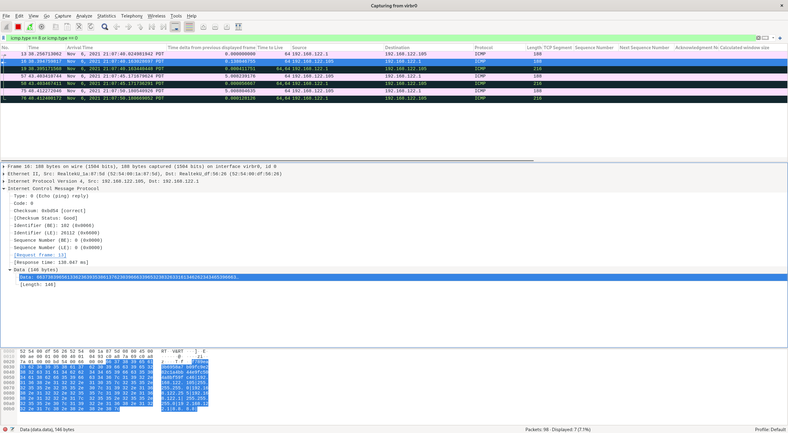

# ARP Stuffing Extension

## Intro

I started this project around mid-Oct. 2021 when I read the ARP protocol chapter from the book [TCP/IP Illustrated, Volume 1: The Protocols](https://www.amazon.com/TCP-Illustrated-Protocols-Addison-Wesley-Professional/dp/0321336313). ARP Stuffing itself is a popular way to set up an initial IP address on embedded devices that don't have a keyboard or similar input peripheral. Here are the basic steps to use ARP Stuffing:

1. The user's computer has an IP address stuffed manually into its address table (normally with the arp command with the MAC address taken from a label on the device)
2. The computer sends special packets to the device, typically a ping packet with a non-default size.
3. The device then adopts this IP address
4. The user then communicates with it by telnet or web protocols to complete the configuration.

Everything looks fine, right? Why did I come up with this **ARP Stuffing Extension**? Well, first of all, ARP Stuffing only sets up IP address typically, which means the user still needs to log in to the host and set up default gateway and DNS etc.. So I was thinking if I can manipulate ICMP Echo Request packet to carry more information(gateway and DNS) then the target device can decode it and set up the network environment based on the data payload. This would be more convenient for the engineers who need to set up a bunch of embedded devices. Of course, DHCP can be used in this scenario. However, it's an extension(I called it an extension :-)) on the original ARP Stuffing so we don't discuss DHCP use in this document. Secondly, I do notice the Python package [Scapy](https://scapy.readthedocs.io/en/latest/) is really powerful and I never wrote any networking protocol manipulation code before so I wanted to use this project to help me understand the protocols more comprehensively, education purpose :-)

The implementation I write is actually manipulating ICMP protocol. However, it's kinda using the same idea of ARP Stuffing so I would like to call it ARP Stuffing Extension. I will use the word **ASE** to indicate **ARP Stuffing Extension** in the rest of the document.

## Terms

There are some terms I want to clarify before diving into details.

**Sender Host**: The node which is to send the special ICMP Echo Request

**Target Host**: The node which is to receive the special Echo Request

**Client**: The software piece to implement ASE. The role of the Client is to construct packets on the Sender Host and send them to the Target Host

**Server**: The software piece to implement ASE. The role of the Server is to receive the packet from the Client then decode it and configure OS networking configurations on the Target Host

## Protocol Implementation Details

### High-level Review

The main difference between ASE and original ARP Stuffing is the ASE Client generates a special ICMP Echo Request with required networking information for the Target Host. ICMP Echo Request packet has an *optional* data payload area so the ASE client stores all those networking information in that area. The ASE Server will run in standalone mode on the Target Host and listen on a specific Ethernet interface that we want to configure. Once the Target Host receives the *correct* ICMP Echo Request packet from the Sender Host, the ASE Server will stop the sniffing then start to decode the packet and retrieve the data payload then saving them into some Python data structures. Once all needed information is saved properly, ASE Server will set up networking configuration and send ICMP Echo Reply packets to the Sender Host to notify ASE Client that the networking configuration is set up done on the Target Host then exit.

Because the IP protocol data delivery is in *best effort* mode, so in order to reduce the data loss possibility, the ASE Server will send 3 ICMP Echo Reply packets with 5 seconds gap. **All 3 ICMP Echo Reply packets have the same ICMP identifier and sequence number**.

### ICMP Echo Request Data Payload

The ICMP Echo Request data payload is constructed as follows:

```
Packet Magic Number|Target Host IP Address|Target Host IP Netmask|Target Host Broadcast IP Address|Getway IP Address|Gateway Netmask|DNS1 IP Address|DNS2 IP Address|DNS3 IP Address
```

In this case, **Packet Magic Number** is a magic string that for ASE Server to determine if a *correct* ICMP Echo Request packet is received. The following Python code snippet shows how to generate the magic number:

```python
output = ''

for c in 'arpstuffingextension':
    output += str(ord(c))

magic_number = hex(int(output))[2:]
```

The magic number is **f789ea3b6958a7b09fc9e282c1a4bb44e9fc504a8bf59fc46**.

The required entries in the data payload are **Packet Magic Number**, **Target Host IP Address** and **Target Host IP Netmask**. The rest of the entries are optional.

### ASE ICMP Echo Request Packet Example - Sender Host IP Address: 192.168.122.1 - WireShark Screenshot


### ASE ICMP Echo Reply Packet Example - Target Host IP Address: 192.168.122.105 - WireShark Screenshot



## Usage

Both ASE Client and ASE Server must run under effective UID **0** because only superuser can create RAW sockets for IP and ICMP protocols manipulation.

### Python Module Dependencies

```
argparse
fcntl
ipaddress
os
scapy
signal
sys
time
```

### Command Dependencies

ASE Server uses [ip](https://man7.org/linux/man-pages/man8/ip.8.html) command to back up and set up networking configurations.

### ASE Client Usage

```
$ sudo ./ase-client.py -h
usage: ase-client.py [-h] --ethersrc ETHERSRC --etherdst ETHERDST --ipsrc IPSRC --ipdst IPDST --dstipnetmask DSTIPNETMASK [--dstbroadcastip DSTBROADCASTIP]
                     [--dstgatewayip DSTGATEWAYIP] [--dstgatewaynetmask DSTGATEWAYNETMASK] [--dstdns1ip DSTDNS1IP] [--dstdns2ip DSTDNS2IP] [--dstdns3ip DSTDNS3IP] --interface
                     INTERFACE [--timeout TIMEOUT]

ARP Stuffing Extension Client - Scapy Version

optional arguments:
  -h, --help            show this help message and exit
  --ethersrc ETHERSRC   Ethernet source hardware address
  --etherdst ETHERDST   Ethernet destination hardware address
  --ipsrc IPSRC         Source IP address
  --ipdst IPDST         Destination IP address
  --dstipnetmask DSTIPNETMASK
                        Destination IP netmask
  --dstbroadcastip DSTBROADCASTIP
                        Destination broadcast IP address
  --dstgatewayip DSTGATEWAYIP
                        Destination gateway IP address
  --dstgatewaynetmask DSTGATEWAYNETMASK
                        Destination gateway netmask
  --dstdns1ip DSTDNS1IP
                        Destination DNS1 IP address
  --dstdns2ip DSTDNS2IP
                        Destination DNS2 IP address
  --dstdns3ip DSTDNS3IP
                        Destination DNS3 IP address
  --interface INTERFACE
                        Interface to send ICMP request (interfaces: lo|00:00:00:00:00:00 virbr0|52:54:00:df:56:26 vnet11|fe:54:00:1a:87:5d)
  --timeout TIMEOUT     Timeout to wait for Echo Response packet (default: 30 secs)
```

### ASE Server Usage

```
$ sudo ./ase-server.py -h
usage: ase-server.py [-h] --interface INTERFACE

ARP Stuffing Extension Server - Scapy Version

optional arguments:
  -h, --help            show this help message and exit
  --interface INTERFACE
                        Interface to be configured (interfaces: lo|00:00:00:00:00:00 virbr0|52:54:00:df:56:26 vnet11|fe:54:00:1a:87:5d)
```

#### ASE Server Notes

1. ASE Server uses a file locking facility to make sure only one instance can be running at the same time.

2. The Ethernet interface must be in **promiscuous mode** to support sniffing packets.

3. Once ASE Server receives SIGINT or SIGTERM, a cleanup function will be triggered to close the filehandle and remove the PID lock file.

4. Before setting up the networking configuration, ASE Server will back up the current Target Host networking configurations under `/var/run/ase-backup` directory.

5. ASE will be terminated with a non-zero exit code if it encounters an error during setting up networking configuration.

6. **DO NOT** run ASE Server on a host that has networking configuration set up properly already. This may cause unpredictable results. Remember, ASE should be only used for devices that don't have networking configurations.

## Usage Examples

In this section, I use 2 Linux hosts to simulate Send Host and Target Host. Both are running Fedora 34. Users would notice I split some outputs to give better ideas on what actually happened. The example case I run is a successful running case.

Sender Host Ethernet Interface Name: `virbr0`

Sender Host Ethernet MAC Address: `52:54:00:df:56:26`   

Sender Host IP Address: `192.168.122.1`

Target Host Ethernet Interface Name: `enp1s0`

Target Host Ethernet MAC Address: `52:54:00:1a:87:5d`

Target Host IP Address: `192.168.122.105` (to be configured)

Target Host IP Address Netmask: `255.255.255.0` (to be configured)

Target Host Broadcast IP Address: `192.168.122.255` (to be generated from Target Host IP Address and Target Host IP Address Netmask)

Target Host Gateway IP Address: `192.168.122.1` (to be configured)

Target Host Gateway Netmask: `255.255.255.0` (to be configured)

Target DNS1 IP Address: `192.168.122.1` (to be configured)

Target DNS2 IP Address: `8.8.8.8` (to be configured)

Target DNS3 IP Address: *blank*

0. Clear Target Host networking configurations - Target Host

```
# nmcli connection delete enp1s0
# echo > /etc/resolv.conf
```

1. Start ASE Server - Target Server

```
# ./ase-server.py --interface enp1s0
No process is running. Safe to initiate main program. 
```

2. Send ICMP Echo Request Packet with the networking parameters data payload via ASE Client - Sender Host

```
# ./ase-client.py --ethersrc '52:54:00:df:56:26' --etherdst '52:54:00:1a:87:5d' --ipsrc 192.168.122.1 --ipdst 192.168.122.105 --dstipnetmask 255.255.255.0 --dstgatewayip 192.168.122.1 --dstgatewaynetmask 255.255.255.0 --dstdns1ip 192.168.122.1 --dstdns2ip 8.8.8.8 --interface virbr0
```

3. ASE Client displays detailed information about the ICMP Echo Request and sends the request packet to Target Host - Sender Host
```
##### Echo Request Data Payload #####

Data Payload String: f789ea3b6958a7b09fc9e282c1a4bb44e9fc504a8bf59fc46|192.168.122.105|255.255.255.0|192.168.122.255|192.168.122.1|255.255.255.0|192.168.122.1|8.8.8.8|

Packet Magic Number: f789ea3b6958a7b09fc9e282c1a4bb44e9fc504a8bf59fc46
Target Host IP Address: 192.168.122.105
Target Host IP Netmask: 255.255.255.0
Target Host Broadcast IP Address: 192.168.122.255
Gateway IP Address: 192.168.122.1
Gateway Netmask: 255.255.255.0
DNS1 IP Address: 192.168.122.1
DNS2 IP Address: 8.8.8.8
DNS3 IP Address: 

##### Raw Packet Bytes #####
b'RT\x00\x1a\x87]RT\x00\xdfV&\x08\x00E\x00\x00\xae\x00\x01\x00\x00@\x01\x04\x93\xc0\xa8z\x01\xc0\xa8zi\x08\x00\xa1\x02\x14\xb8\x00\x00f789ea3b6958a7b09fc9e282c1a4bb44e9fc504a8bf59fc46|192.168.122.105|255.255.255.0|192.168.122.255|192.168.122.1|255.255.255.0|192.168.122.1|8.8.8.8|'

###[ Ethernet ]### 
  dst       = 52:54:00:1a:87:5d
  src       = 52:54:00:df:56:26
  type      = IPv4
###[ IP ]### 
     version   = 4
     ihl       = None
     tos       = 0x0
     len       = None
     id        = 1
     flags     = 
     frag      = 0
     ttl       = 64
     proto     = icmp
     chksum    = None
     src       = 192.168.122.1
     dst       = 192.168.122.105
     \options   \
###[ ICMP ]### 
        type      = echo-request
        code      = 0
        chksum    = None
        id        = 0x14b8
        seq       = 0x0
        unused    = ''
###[ Raw ]### 
           load      = 'f789ea3b6958a7b09fc9e282c1a4bb44e9fc504a8bf59fc46|192.168.122.105|255.255.255.0|192.168.122.255|192.168.122.1|255.255.255.0|192.168.122.1|8.8.8.8|'


0000  52 54 00 1A 87 5D 52 54 00 DF 56 26 08 00 45 00  RT...]RT..V&..E.
0010  00 AE 00 01 00 00 40 01 04 93 C0 A8 7A 01 C0 A8  ......@.....z...
0020  7A 69 08 00 A1 02 14 B8 00 00 66 37 38 39 65 61  zi........f789ea
0030  33 62 36 39 35 38 61 37 62 30 39 66 63 39 65 32  3b6958a7b09fc9e2
0040  38 32 63 31 61 34 62 62 34 34 65 39 66 63 35 30  82c1a4bb44e9fc50
0050  34 61 38 62 66 35 39 66 63 34 36 7C 31 39 32 2E  4a8bf59fc46|192.
0060  31 36 38 2E 31 32 32 2E 31 30 35 7C 32 35 35 2E  168.122.105|255.
0070  32 35 35 2E 32 35 35 2E 30 7C 31 39 32 2E 31 36  255.255.0|192.16
0080  38 2E 31 32 32 2E 32 35 35 7C 31 39 32 2E 31 36  8.122.255|192.16
0090  38 2E 31 32 32 2E 31 7C 32 35 35 2E 32 35 35 2E  8.122.1|255.255.
00a0  32 35 35 2E 30 7C 31 39 32 2E 31 36 38 2E 31 32  255.0|192.168.12
00b0  32 2E 31 7C 38 2E 38 2E 38 2E 38 7C              2.1|8.8.8.8|
None

Ether(dst='52:54:00:1a:87:5d', src='52:54:00:df:56:26', type=2048)/IP(version=4, ttl=64, proto=1, src='192.168.122.1', dst='192.168.122.105')/ICMP(type=8, code=0, id=5304, seq=0)/Raw(load=b'f789ea3b6958a7b09fc9e282c1a4bb44e9fc504a8bf59fc46|192.168.122.105|255.255.255.0|192.168.122.255|192.168.122.1|255.255.255.0|192.168.122.1|8.8.8.8|')

Begin emission:
Finished sending 1 packets.
.*
```

4. ASE Server receives the *correct* ICMP Echo Request packet and set up networking configurations - Target Host

```
##### ARP Stuffing Extention - ICMP Echo Request Received #####
Magic Number: f789ea3b6958a7b09fc9e282c1a4bb44e9fc504a8bf59fc46

##### ICMP Echo Request Packet Data Payload Fields #####
ether_src: 52:54:00:df:56:26
ether_dst: 52:54:00:1a:87:5d
ip_src: 192.168.122.1
ip_dst: 192.168.122.105
icmp_id: 5304
icmp_seq: 0
icmp_data: f789ea3b6958a7b09fc9e282c1a4bb44e9fc504a8bf59fc46|192.168.122.105|255.255.255.0|192.168.122.255|192.168.122.1|255.255.255.0|192.168.122.1|8.8.8.8|

##### Ethernet Interface Information #####
Ethernet Interface Name: enp1s0
Ethernet Interface MAC Address: 52:54:00:1a:87:5d

##### Backing up Network Configurations #####
IP Address Configs saved at /var/run/ase-backup/ip_address.1636263627
IP Route Table Configs saved at /var/run/ase-backup/ip_route_table.1636263627
IP Rule Configs saved at /var/run/ase-backup/ip_rule.1636263627
Network configurations are backed up successfully.

The interface enp1s0 is set up with IP address 192.168.122.105.
The interface enp1s0 is up.
Default gateway is set up via 192.168.122.1.
DNS resolvers configuration is set up.
Network configuration setup done.
##### Raw Packet Bytes #####
b'RT\x00\xdfV&RT\x00\x1a\x87]\x08\x00E\x00\x00\xae\x00\x01\x00\x00@\x01\x04\x93\xc0\xa8zi\xc0\xa8z\x01\x00\x00\xa9\x02\x14\xb8\x00\x00f789ea3b6958a7b09fc9e282c1a4bb44e9fc504a8bf59fc46|192.168.122.105|255.255.255.0|192.168.122.255|192.168.122.1|255.255.255.0|192.168.122.1|8.8.8.8|'

###[ Ethernet ]### 
  dst       = 52:54:00:df:56:26
  src       = 52:54:00:1a:87:5d
  type      = IPv4
###[ IP ]### 
     version   = 4
     ihl       = None
     tos       = 0x0
     len       = None
     id        = 1
     flags     = 
     frag      = 0
     ttl       = 64
     proto     = icmp
     chksum    = None
     src       = 192.168.122.105
     dst       = 192.168.122.1
     \options   \
###[ ICMP ]### 
        type      = echo-reply
        code      = 0
        chksum    = None
        id        = 0x14b8
        seq       = 0x0
        unused    = ''
###[ Raw ]### 
           load      = 'f789ea3b6958a7b09fc9e282c1a4bb44e9fc504a8bf59fc46|192.168.122.105|255.255.255.0|192.168.122.255|192.168.122.1|255.255.255.0|192.168.122.1|8.8.8.8|'


0000  52 54 00 DF 56 26 52 54 00 1A 87 5D 08 00 45 00  RT..V&RT...]..E.
0010  00 AE 00 01 00 00 40 01 04 93 C0 A8 7A 69 C0 A8  ......@.....zi..
0020  7A 01 00 00 A9 02 14 B8 00 00 66 37 38 39 65 61  z.........f789ea
0030  33 62 36 39 35 38 61 37 62 30 39 66 63 39 65 32  3b6958a7b09fc9e2
0040  38 32 63 31 61 34 62 62 34 34 65 39 66 63 35 30  82c1a4bb44e9fc50
0050  34 61 38 62 66 35 39 66 63 34 36 7C 31 39 32 2E  4a8bf59fc46|192.
0060  31 36 38 2E 31 32 32 2E 31 30 35 7C 32 35 35 2E  168.122.105|255.
0070  32 35 35 2E 32 35 35 2E 30 7C 31 39 32 2E 31 36  255.255.0|192.16
0080  38 2E 31 32 32 2E 32 35 35 7C 31 39 32 2E 31 36  8.122.255|192.16
0090  38 2E 31 32 32 2E 31 7C 32 35 35 2E 32 35 35 2E  8.122.1|255.255.
00a0  32 35 35 2E 30 7C 31 39 32 2E 31 36 38 2E 31 32  255.0|192.168.12
00b0  32 2E 31 7C 38 2E 38 2E 38 2E 38 7C              2.1|8.8.8.8|
None

Ether(dst='52:54:00:df:56:26', src='52:54:00:1a:87:5d', type=2048)/IP(version=4, ttl=64, proto=1, src='192.168.122.105', dst='192.168.122.1')/ICMP(type=0, code=0, id=5304, seq=0)/Raw(load=b'f789ea3b6958a7b09fc9e282c1a4bb44e9fc504a8bf59fc46|192.168.122.105|255.255.255.0|192.168.122.255|192.168.122.1|255.255.255.0|192.168.122.1|8.8.8.8|')


Sent 3 packets.
```

5. ASE Client receives the ICMP Echo Reply from Sender Host and displays the reply packet detailed information - Sender Host

```
[... continues from ASE Client output ...]
Received 2 packets, got 1 answers, remaining 0 packets
##### Raw Packet Bytes #####
b'RT\x00\xdfV&RT\x00\x1a\x87]\x08\x00E\x00\x00\xae\x00\x01\x00\x00@\x01\x04\x93\xc0\xa8zi\xc0\xa8z\x01\x00\x00\xa9\x02\x14\xb8\x00\x00f789ea3b6958a7b09fc9e282c1a4bb44e9fc504a8bf59fc46|192.168.122.105|255.255.255.0|192.168.122.255|192.168.122.1|255.255.255.0|192.168.122.1|8.8.8.8|'

###[ Ethernet ]### 
  dst       = 52:54:00:df:56:26
  src       = 52:54:00:1a:87:5d
  type      = IPv4
###[ IP ]### 
     version   = 4
     ihl       = 5
     tos       = 0x0
     len       = 174
     id        = 1
     flags     = 
     frag      = 0
     ttl       = 64
     proto     = icmp
     chksum    = 0x493
     src       = 192.168.122.105
     dst       = 192.168.122.1
     \options   \
###[ ICMP ]### 
        type      = echo-reply
        code      = 0
        chksum    = 0xa902
        id        = 0x14b8
        seq       = 0x0
        unused    = ''
###[ Raw ]### 
           load      = 'f789ea3b6958a7b09fc9e282c1a4bb44e9fc504a8bf59fc46|192.168.122.105|255.255.255.0|192.168.122.255|192.168.122.1|255.255.255.0|192.168.122.1|8.8.8.8|'


0000  52 54 00 DF 56 26 52 54 00 1A 87 5D 08 00 45 00  RT..V&RT...]..E.
0010  00 AE 00 01 00 00 40 01 04 93 C0 A8 7A 69 C0 A8  ......@.....zi..
0020  7A 01 00 00 A9 02 14 B8 00 00 66 37 38 39 65 61  z.........f789ea
0030  33 62 36 39 35 38 61 37 62 30 39 66 63 39 65 32  3b6958a7b09fc9e2
0040  38 32 63 31 61 34 62 62 34 34 65 39 66 63 35 30  82c1a4bb44e9fc50
0050  34 61 38 62 66 35 39 66 63 34 36 7C 31 39 32 2E  4a8bf59fc46|192.
0060  31 36 38 2E 31 32 32 2E 31 30 35 7C 32 35 35 2E  168.122.105|255.
0070  32 35 35 2E 32 35 35 2E 30 7C 31 39 32 2E 31 36  255.255.0|192.16
0080  38 2E 31 32 32 2E 32 35 35 7C 31 39 32 2E 31 36  8.122.255|192.16
0090  38 2E 31 32 32 2E 31 7C 32 35 35 2E 32 35 35 2E  8.122.1|255.255.
00a0  32 35 35 2E 30 7C 31 39 32 2E 31 36 38 2E 31 32  255.0|192.168.12
00b0  32 2E 31 7C 38 2E 38 2E 38 2E 38 7C              2.1|8.8.8.8|
None

Ether(dst='52:54:00:df:56:26', src='52:54:00:1a:87:5d', type=2048)/IP(version=4, ihl=5, tos=0, len=174, id=1, flags=0, frag=0, ttl=64, proto=1, chksum=1171, src='192.168.122.105', dst='192.168.122.1')/ICMP(type=0, code=0, chksum=43266, id=5304, seq=0, unused=b'')/Raw(load=b'f789ea3b6958a7b09fc9e282c1a4bb44e9fc504a8bf59fc46|192.168.122.105|255.255.255.0|192.168.122.255|192.168.122.1|255.255.255.0|192.168.122.1|8.8.8.8|')

```

6. Target Host networking configurations are set up done - Target Host

```
# ip link show dev enp1s0
2: enp1s0: <BROADCAST,MULTICAST,UP,LOWER_UP> mtu 1500 qdisc fq_codel state UP mode DEFAULT group default qlen 1000
    link/ether 52:54:00:1a:87:5d brd ff:ff:ff:ff:ff:ff

# ip address show dev enp1s0
2: enp1s0: <BROADCAST,MULTICAST,UP,LOWER_UP> mtu 1500 qdisc fq_codel state UP group default qlen 1000
    link/ether 52:54:00:1a:87:5d brd ff:ff:ff:ff:ff:ff
    inet 192.168.122.105/24 brd 192.168.122.255 scope global enp1s0
       valid_lft forever preferred_lft forever

# ip route show
default via 192.168.122.1 dev enp1s0 
192.168.122.0/24 dev enp1s0 proto kernel scope link src 192.168.122.105 

# cat /etc/resolv.conf 
nameserver 192.168.122.1
nameserver 8.8.8.8

# ping -c 5 www.yahoo.com
PING new-fp-shed.wg1.b.yahoo.com (74.6.231.21) 56(84) bytes of data.
64 bytes from media-router-fp74.prod.media.vip.ne1.yahoo.com (74.6.231.21): icmp_seq=1 ttl=50 time=50.2 ms
64 bytes from media-router-fp74.prod.media.vip.ne1.yahoo.com (74.6.231.21): icmp_seq=2 ttl=50 time=59.7 ms
64 bytes from media-router-fp74.prod.media.vip.ne1.yahoo.com (74.6.231.21): icmp_seq=3 ttl=50 time=93.1 ms
64 bytes from media-router-fp74.prod.media.vip.ne1.yahoo.com (74.6.231.21): icmp_seq=4 ttl=50 time=55.1 ms
64 bytes from media-router-fp74.prod.media.vip.ne1.yahoo.com (74.6.231.21): icmp_seq=5 ttl=50 time=69.8 ms

--- new-fp-shed.wg1.b.yahoo.com ping statistics ---
5 packets transmitted, 5 received, 0% packet loss, time 4008ms
rtt min/avg/max/mdev = 50.233/65.603/93.135/15.214 ms
```

## Notes and Thoughts

1. The ASE protocol and Client / Server I wrote only support IPv4 so far.

2. The ASE Client / Server are more like a set of prototype implementations. Because in order to get best performance, I would write the Server by using the Python [socket](https://docs.python.org/3/library/socket.html) module.

3. I assume the Target Host has ability to reset the networking configurations if the setup procedure is failed. It's quite normal on embedded devices to have a RESET button or something similar.

Any thoughts and suggestions are welcome, Thanks!
